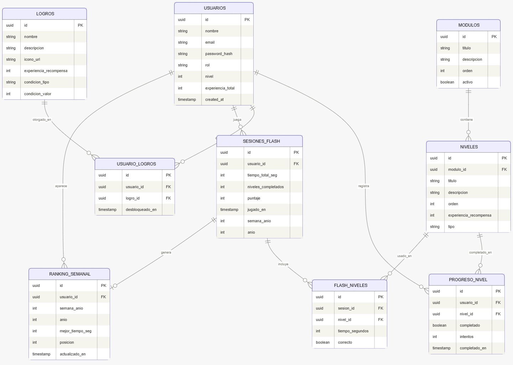
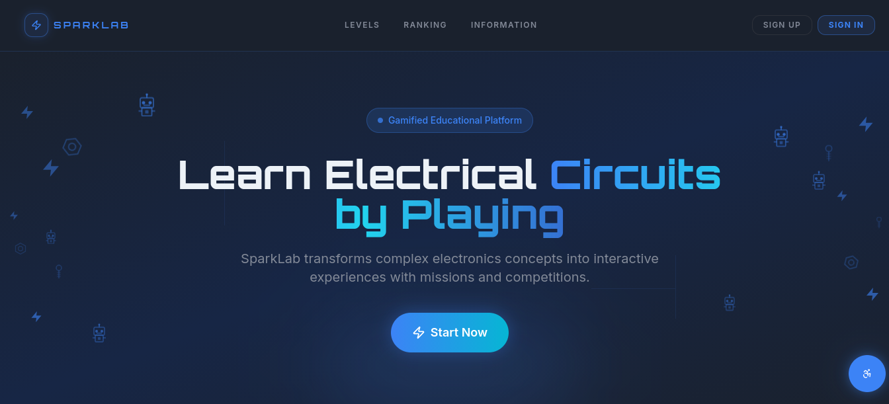
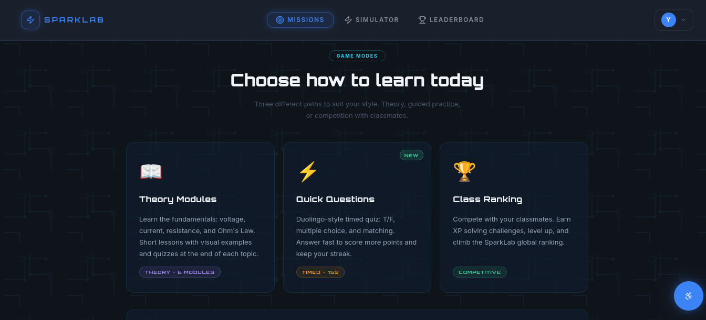
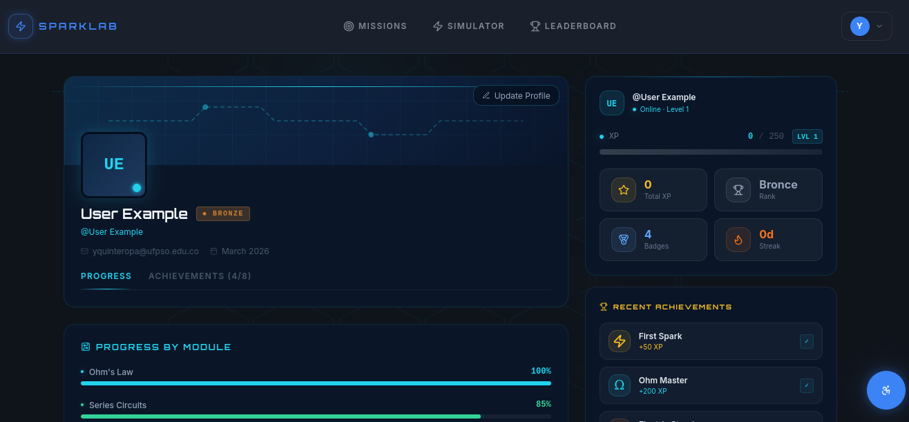
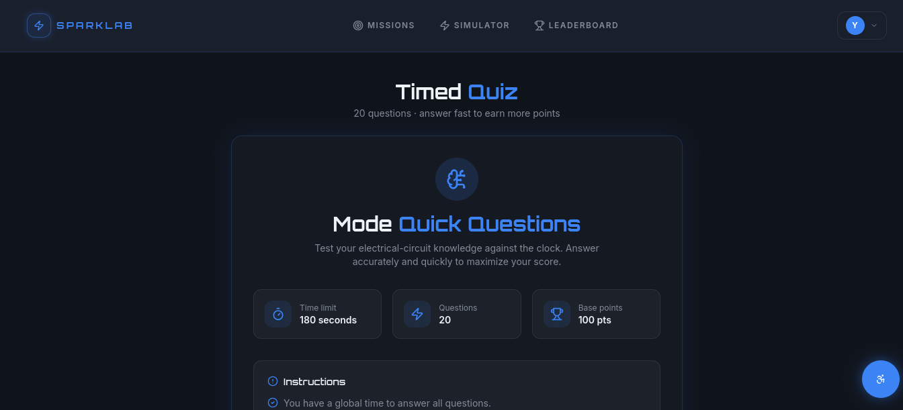
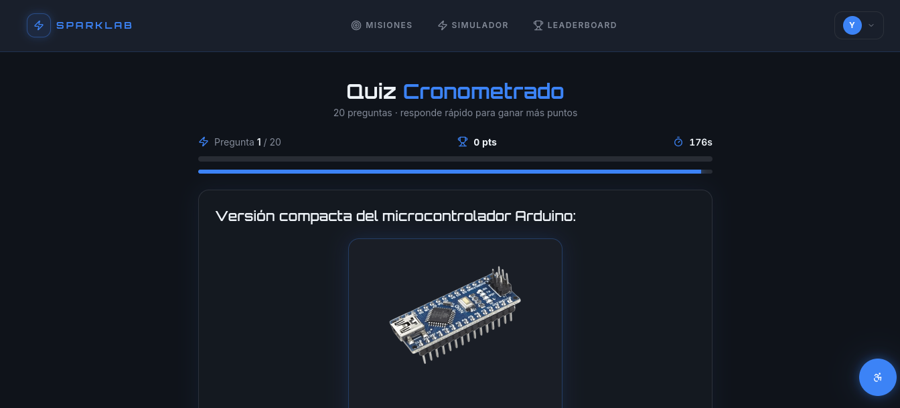
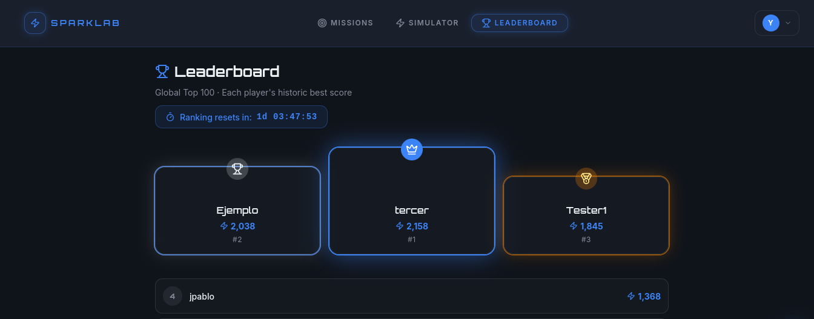
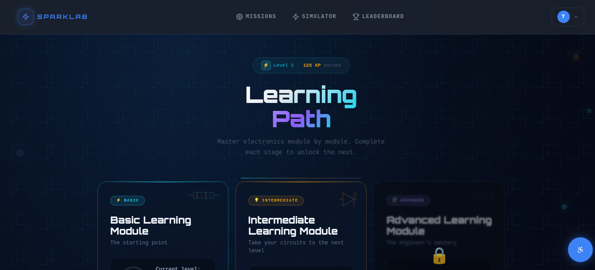
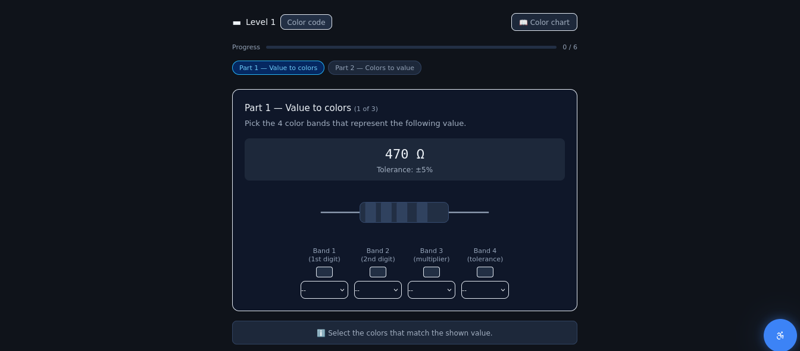
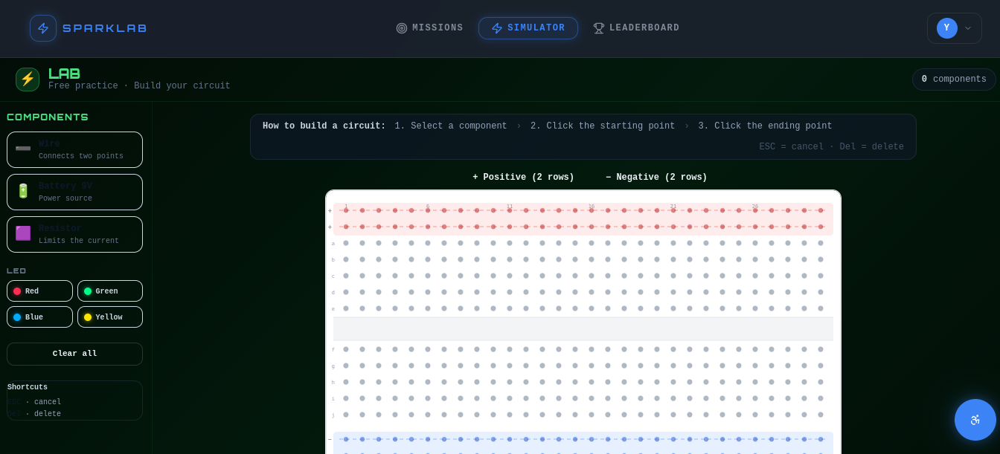

# SparkLab

## Description
A gamified platform designed for teaching and learning electronic components. The application allows students to identify components through visual challenges, incorporating time-based mechanics and progress tracking.

## General Objective
To develop a gamified platform for teaching basic electrical circuit concepts using game elements such as challenges and rewards, in order to strengthen student engagement and improve knowledge retention.

### Specific Objectives
- Establish pedagogical and technical requirements by analyzing background information and gamification references to create a solid theoretical foundation for teaching circuits.
- Structure the logic architecture and game mechanics of the platform, defining interaction rules and electronic learning levels.
- Build a functional prototype that integrates missions, scoring systems, and level unlocking, allowing for the validation of gamified elements in solving theoretical circuit problems.

## Technologies Used
- **Framework:** Lovable (React + Tailwind CSS)
- **Backend:** Supabase (PostgreSQL Database and Auth)
- **Languages:** TypeScript/JavaScript
- **Hosting:** Vercel
- **Domain:** name.com

## Entity-Relationship Model (ERM)

## Main Features
- **User Management (CRUD)**
- **Timed Mode:** Mental agility challenge for identifying components and general electronics knowledge questions.
- **Leaderboard:** Global weekly ranking based on the highest scores obtained by users in Timed Mode.
- **Theory Modules:** Introduction to theoretical concepts with practical application in electrical circuit assembly.
- **Accessibility:** Persistent features such as toggling visual modes (Light/Dark), language selection, and font size adjustment.
- **Virtual Lab (Beta):** A simulator of a laboratory environment with electronic components (Currently under development).

## Results

